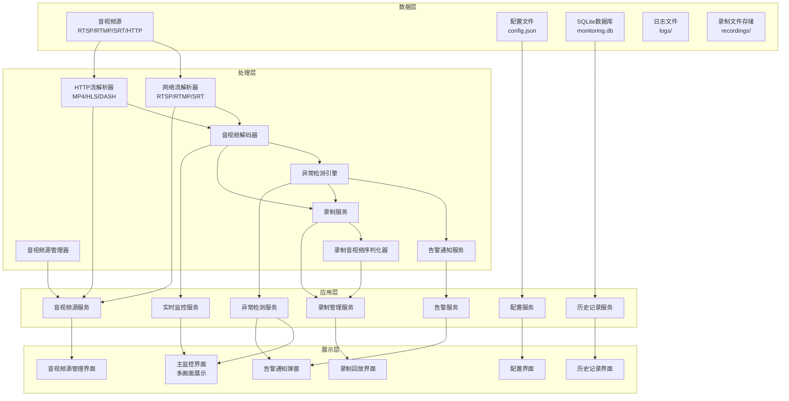
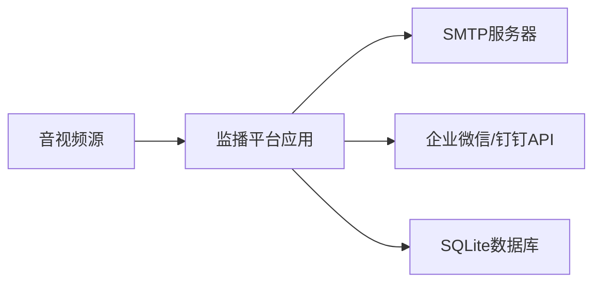

# 音视频监播平台

Feature Name: audio-video-monitoring-platform
Updated: 2026-02-06

## 描述

音视频监播平台是一个单机部署的实时监控系统,用于监控广播电视和新媒体的音视频播出内容。系统支持RTSP、RTMP、SRT等网络流和HTTP流的接入,提供多画面实时监看功能,能够自动检测信号中断、画面异常(黑屏、雪花屏、静止)、音频异常(静音、音量异常)等故障,并通过界面弹窗、声音提示、邮件、即时消息等多种方式及时告警,帮助用户确保播出质量和内容安全。

## 架构

系统采用分层架构设计,主要分为数据层、处理层、应用层和展示层。



### 技术栈

- **前端框架**: Electron + React + TypeScript
- **后端服务**: Node.js
- **音视频处理**: FFmpeg
- **数据库**: SQLite
- **构建工具**: Vite
- **UI组件库**: Ant Design

### 系统部署



## 组件和接口

### 音视频源管理器 (AudioSourceManager)

**职责**: 管理音视频源的增删改查和状态维护

**接口**:
```typescript
interface AudioSource {
  id: string;
  name: string;
  url: string;
  protocol: 'RTSP' | 'RTMP' | 'SRT' | 'HTTP';
  format?: 'MP4' | 'HLS' | 'DASH';
  status: 'connected' | 'disconnected' | 'error';
  createdAt: Date;
  updatedAt: Date;
}

class AudioSourceManager {
  addSource(source: AudioSource): Promise<void>;
  updateSource(id: string, source: Partial<AudioSource>): Promise<void>;
  deleteSource(id: string): Promise<void>;
  getSource(id: string): Promise<AudioSource | null>;
  getAllSources(): Promise<AudioSource[]>;
  updateStatus(id: string, status: AudioSource['status']): Promise<void>;
}
```

### 网络流解析器 (NetworkStreamParser)

**职责**: 解析RTSP、RTMP、SRT协议的网络流数据

**接口**:
```typescript
interface StreamFrame {
  type: 'video' | 'audio';
  timestamp: number;
  data: Buffer;
  codec: string;
  keyFrame?: boolean;
}

class NetworkStreamParser {
  parseRTSP(url: string): Observable<StreamFrame>;
  parseRTMP(url: string): Observable<StreamFrame>;
  parseSRT(url: string): Observable<StreamFrame>;
  getStreamInfo(url: string): Promise<StreamInfo>;
}
```

### HTTP流解析器 (HTTPStreamParser)

**职责**: 解析HTTP协议的音视频流和文件

**接口**:
```typescript
class HTTPStreamParser {
  parseMP4(url: string): Observable<StreamFrame>;
  parseHLS(url: string): Observable<StreamFrame>;
  parseDASH(url: string): Observable<StreamFrame>;
  getStreamInfo(url: string): Promise<StreamInfo>;
}
```

### 音视频解码器 (MediaDecoder)

**职责**: 解码音视频帧数据,输出可播放的格式

**接口**:
```typescript
interface DecodedFrame {
  type: 'video' | 'audio';
  timestamp: number;
  width?: number;
  height?: number;
  data: Buffer;
  format: string;
}

class MediaDecoder {
  decodeVideo(frame: StreamFrame): Promise<DecodedFrame>;
  decodeAudio(frame: StreamFrame): Promise<DecodedFrame>;
  start(sourceId: string): void;
  stop(sourceId: string): void;
}
```

### 异常检测引擎 (AnomalyDetector)

**职责**: 检测画面异常、音频异常和信号中断

**接口**:
```typescript
interface AnomalyEvent {
  type: 'black_screen' | 'snow_screen' | 'static_screen' | 'audio_loss' | 'low_volume' | 'high_volume' | 'signal_loss';
  sourceId: string;
  sourceName: string;
  startTime: Date;
  endTime?: Date;
  duration?: number;
  details: Record<string, any>;
}

class AnomalyDetector {
  detectBlackScreen(frames: VideoFrame[]): boolean;
  detectSnowScreen(frames: VideoFrame[]): boolean;
  detectStaticScreen(frames: VideoFrame[]): boolean;
  detectAudioLoss(audioData: AudioFrame[]): boolean;
  detectLowVolume(audioData: AudioFrame[], threshold: number): boolean;
  detectHighVolume(audioData: AudioFrame[], threshold: number): boolean;
  detectSignalLoss(lastFrameTime: Date, timeout: number): boolean;
  startMonitoring(sourceId: string): void;
  stopMonitoring(sourceId: string): void;
}
```

### 告警通知服务 (AlertService)

**职责**: 通过多种方式发送告警通知

**接口**:
```typescript
interface AlertConfig {
  email: {
    enabled: boolean;
    smtpHost: string;
    smtpPort: number;
    username: string;
    password: string;
    to: string[];
  };
  instantMessage: {
    enabled: boolean;
    type: 'wechat' | 'dingtalk';
    webhookUrl: string;
  };
  sound: {
    enabled: boolean;
    volume: number;
    filePath: string;
  };
}

class AlertService {
  sendAlert(anomaly: AnomalyEvent): Promise<void>;
  sendRecovery(anomaly: AnomalyEvent): Promise<void>;
  sendEmailAlert(anomaly: AnomalyEvent): Promise<void>;
  sendInstantMessageAlert(anomaly: AnomalyEvent): Promise<void>;
  playSoundAlert(anomaly: AnomalyEvent): void;
  stopSoundAlert(): void;
  showPopupAlert(anomaly: AnomalyEvent): void;
  dismissAlert(anomalyId: string): void;
}
```

### 配置服务 (ConfigService)

**职责**: 管理系统配置

**接口**:
```typescript
interface SystemConfig {
  sources: AudioSource[];
  alert: AlertConfig;
  detection: {
    blackScreenThreshold: number;
    snowScreenThreshold: number;
    staticScreenTimeout: number;
    audioLossTimeout: number;
    lowVolumeThreshold: number;
    highVolumeThreshold: number;
    signalLossTimeout: number;
  };
  alertFrequency: {
    emailInterval: number;
    instantMessageInterval: number;
  };
}

class ConfigService {
  getConfig(): SystemConfig;
  updateConfig(config: Partial<SystemConfig>): void;
  saveConfig(): Promise<void>;
  loadConfig(): Promise<void>;
}
```

### 历史记录服务 (HistoryService)

**职责**: 管理异常历史记录

**接口**:
```typescript
class HistoryService {
  recordAnomaly(anomaly: AnomalyEvent): Promise<void>;
  updateAnomaly(anomalyId: string, updates: Partial<AnomalyEvent>): Promise<void>;
  getAnomalies(filters?: {
    sourceId?: string;
    startDate?: Date;
    endDate?: Date;
    type?: AnomalyEvent['type'];
  }): Promise<AnomalyEvent[]>;
  exportToCSV(anomalies: AnomalyEvent[]): string;
}
```

### 录制服务 (RecordingService)

**职责**: 管理异常期间的音视频录制

**接口**:
```typescript
interface RecordingConfig {
  enabled: boolean;
  preRecordDuration: number;
  postRecordDuration: number;
  storagePath: string;
  maxRetentionDays: number;
}

interface RecordingFile {
  id: string;
  anomalyId: string;
  sourceId: string;
  sourceName: string;
  anomalyType: string;
  filePath: string;
  startTime: Date;
  endTime: Date;
  duration: number;
  fileSize: number;
}

class RecordingService {
  startRecording(anomaly: AnomalyEvent): Promise<RecordingFile>;
  stopRecording(recordingId: string): Promise<void>;
  getRecording(recordingId: string): Promise<RecordingFile | null>;
  getRecordingsByAnomaly(anomalyId: string): Promise<RecordingFile[]>;
  playRecording(recordingId: string): void;
  downloadRecording(recordingId: string): Promise<Buffer>;
  cleanupOldRecordings(): Promise<void>;
}
```

### 录制音视频序列化器 (RecordingSerializer)

**职责**: 将音视频帧数据序列化为MP4文件

**接口**:
```typescript
interface RecordingOptions {
  videoCodec: 'H.264';
  audioCodec: 'AAC';
  bitrate: number;
}

class RecordingSerializer {
  startRecording(filePath: string, options: RecordingOptions): void;
  writeVideoFrame(frame: DecodedFrame): void;
  writeAudioFrame(frame: DecodedFrame): void;
  stopRecording(): Promise<void>;
  getRecordingInfo(filePath: string): Promise<RecordingInfo>;
}
```

### 录制音视频漂亮打印器 (RecordingPrettyPrinter)

**职责**: 以人类可读格式显示录制文件的音视频信息

**接口**:
```typescript
class RecordingPrettyPrinter {
  printRecordingInfo(filePath: string): string;
  printRecordingStructure(filePath: string): string;
  printRecordingMetadata(filePath: string): string;
  validateRecording(filePath: string): ValidationResult;
}
```

## 数据模型

### 音视频源表 (audio_sources)

| 字段 | 类型 | 说明 | 约束 |
|------|------|------|------|
| id | TEXT | 音视频源唯一标识 | PRIMARY KEY |
| name | TEXT | 音视频源名称 | NOT NULL |
| url | TEXT | 音视频流URL | NOT NULL |
| protocol | TEXT | 协议类型 | NOT NULL |
| format | TEXT | 格式类型 | |
| status | TEXT | 连接状态 | NOT NULL |
| created_at | TEXT | 创建时间 | NOT NULL |
| updated_at | TEXT | 更新时间 | NOT NULL |

### 异常记录表 (anomaly_records)

| 字段 | 类型 | 说明 | 约束 |
|------|------|------|------|
| id | TEXT | 异常记录唯一标识 | PRIMARY KEY |
| source_id | TEXT | 音视频源ID | FOREIGN KEY |
| source_name | TEXT | 音视频源名称 | |
| type | TEXT | 异常类型 | NOT NULL |
| start_time | TEXT | 异常开始时间 | NOT NULL |
| end_time | TEXT | 异常结束时间 | |
| duration | INTEGER | 持续时长(秒) | |
| recording_file_path | TEXT | 录制文件路径 | |
| details | TEXT | 异常详情(JSON) | |
| created_at | TEXT | 记录创建时间 | NOT NULL |
| updated_at | TEXT | 记录更新时间 | NOT NULL |

## 正确性属性

### 不变式 (Invariants)

1. **音视频源唯一性**: 每个音视频源的id必须是唯一的
2. **异常记录时间顺序**: 每条异常记录的start_time必须早于或等于end_time
3. **异常持续时间**: 异常记录的duration必须等于end_time与start_time的差值
4. **告警频率限制**: 同一异常类型的邮件告警间隔不得少于配置的最小间隔时间
5. **告警频率限制**: 同一异常类型的即时消息告警间隔不得少于配置的最小间隔时间

### 约束 (Constraints)

1. **音视频源数量限制**: 系统最多支持16个同时监控的音视频源
2. **异常检测实时性**: 异常检测的延迟不得超过5秒
3. **告警发送延迟**: 告警通知必须在异常发生后的30秒内发送
4. **音视频同步**: 音频和视频的时间戳差值不得超过40ms
5. **历史记录存储**: 系统至少保存最近90天的异常记录
6. **录制文件清理**: 系统自动清理超过90天的录制文件以释放存储空间
7. **录制周期**: 每次录制从异常发生前30秒开始,到异常结束后30秒结束

## 错误处理

### 网络连接错误

- **场景**: 音视频源网络连接失败
- **处理策略**:
  1. 记录错误日志
  2. 在界面显示连接失败状态
  3. 尝试自动重连(最多3次,间隔10秒)
  4. 重连失败后触发信号中断告警

### 音视频解码错误

- **场景**: 音视频流数据无法解码
- **处理策略**:
  1. 记录错误日志和错误帧信息
  2. 跳过错误帧继续解码后续帧
  3. 如果连续10秒无法解码,触发画面异常告警

### 告警发送失败

- **场景**: 邮件或即时消息发送失败
- **处理策略**:
  1. 记录发送失败日志
  2. 在界面显示发送失败状态
  3. 重试发送(最多2次,间隔30秒)
  4. 重试失败后记录到失败队列,由定时任务重试

### 数据库操作失败

- **场景**: 数据库写入或读取失败
- **处理策略**:
  1. 记录错误日志
  2. 显示友好的错误提示给用户
  3. 尝试回滚未完成的操作
  4. 提供手动重试选项

### 配置文件损坏

- **场景**: 配置文件格式错误或损坏
- **处理策略**:
  1. 备份损坏的配置文件
  2. 加载默认配置
  3. 在界面显示配置加载失败提示
  4. 提供恢复默认配置的选项

### 录制失败

- **场景**: 录制文件写入失败或存储空间不足
- **处理策略**:
  1. 记录错误日志和失败原因
  2. 在界面显示录制失败提示
  3. 如果是存储空间不足,提示用户清理空间
  4. 继续监看和告警,不影响其他功能
  5. 提供手动重试录制的选项

## 测试策略

### 单元测试

- **覆盖范围**: 所有核心组件和服务
- **测试工具**: Jest + Testing Library
- **重点测试**:
  - 音视频源管理器的增删改查操作
  - 异常检测算法的正确性
  - 告警通知服务的发送逻辑
  - 配置服务的读写操作

### 集成测试

- **覆盖范围**: 组件间交互和数据流
- **测试工具**: Playwright(端到端测试) + Supertest(API测试)
- **重点测试**:
  - 音视频源接入到实时监看的完整流程
  - 异常检测到告警发送的完整流程
  - 配置修改到系统应用的完整流程

### 性能测试

- **测试工具**: JMeter + k6
- **测试场景**:
  - 16个音视频源同时监控的资源占用
  - 异常检测的响应延迟
  - 告警发送的吞吐量
  - 录制服务的性能和稳定性

### 音视频解析器测试

- **测试重点**: 解析器和序列化器的往返验证
- **测试数据集**:
  - RTSP流样本
  - RTMP流样本
  - SRT流样本
  - MP4文件样本
  - HLS流样本
  - DASH流样本
- **验证方法**: 使用漂亮打印器对比原始数据和重新序列化数据的一致性

### 录制音视频序列化器测试

- **测试重点**: 录制序列化器的往返验证
- **测试数据集**:
  - H.264编码的视频帧数据
  - AAC编码的音频帧数据
  - 混合音视频流数据
- **验证方法**:
  - 序列化音视频帧为MP4文件
  - 解析MP4文件并提取音视频帧
  - 使用漂亮打印器对比原始帧数据和解析后的帧数据
  - 验证视频像素数据、音频采样数据和时间戳的一致性

## 参考资料

[1]: (Website) - FFmpeg官方文档 (https://ffmpeg.org/documentation.html)
[2]: (Website) - RTSP协议规范 (https://datatracker.ietf.org/doc/html/rfc2326)
[3]: (Website) - RTMP协议规范 (https://www.adobe.com/devnet/rtmp.html)
[4]: (Website) - SRT协议规范 (https://github.com/Haivision/srt/blob/master/docs/API.md)
[5]: (Website) - Electron官方文档 (https://www.electronjs.org/docs)
[6]: (Website) - React官方文档 (https://react.dev/)
[7]: (Website) - Ant Design组件库 (https://ant.design/)
